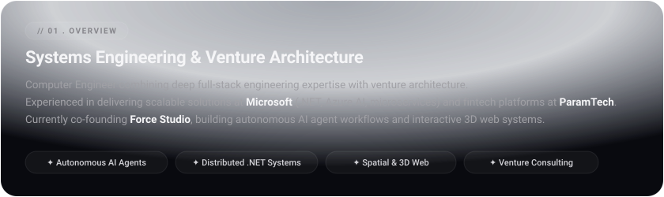
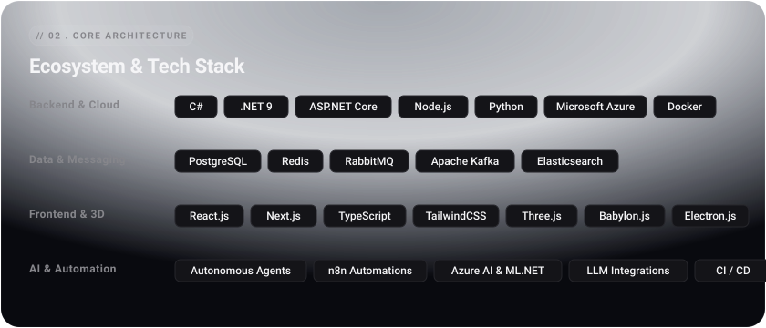

  <!-- Apple Minimalist SVG Header -->
  

    

  <!-- Minimalist Pill Action Buttons (No Logo, Pure Typography & Arrow) -->
  

    
    &nbsp;
    
    &nbsp;
    
  

   

  <!-- Claude-Style Real-time Node Activity Flow -->
  

    

  <!-- Section 01: Overview Card -->
  

    

  <!-- Section 02: Architecture & Toolkit Card -->
  

    

  <!-- Section 03: Featured Ventures & Products Card -->
  

    

  <!-- Activity & Consistency -->
  

    

  

    <i>Designed with an obsession for systems architecture, minimalism, and craftsmanship.</i>
  

